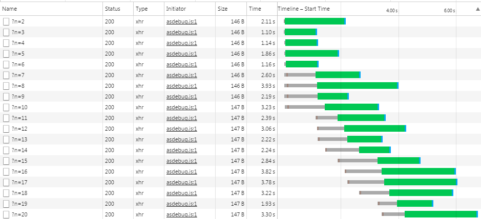

# weplus

Weplus is a lightweight library for wexin mini program developement. Weplus 是一个轻量级的微信小程序开发库。

微信小程序自身提供了一套开发框架，但是存在一些不太完善的地方，随着小程序的不断迭代，相信会越来越完善。现阶段 weplus 目标是作为微信小程序开发的一种渐进式增强库，解决开发中遇到的部分问题。之所以说是渐进式增强，weplus 只是一个库，你可以根据需要只引入其中的部分功能，如果微信支持了这部分特性，可以移除掉这部分 weplus。由于 weplus 只是一个库，可以在现有代码中逐步引入 weplus，weplus 做的事情很简单，你完全可以提供自己的替代实现。

已实现特性:
* 小程序 API promise 化工具
* 支持 fetch API 风格的网络请求接口
* 支持网络请求队列
* 提供 Page 和 Component 基类，提供组件化集成方式

计划特性:
* 优化和重构内部实现
* 请求队列支持 wx.request 回调风格
* 组件支持生命周期
* 支持基于脏检查的数据更新
* 更多...


## 更新日志

**0.1.2**
* 修复 promisify 返回的函数被无参调用时，被错误的 resolve 的 bug

## 教程

### 0. 安装 weplus

通过 npm 或 yarn 安装[@whinc/weplus](https://www.npmjs.com/package/@whinc/weplus)
```bash
npm install @whinc/weplus
# or 
yarn add @whinc/weplus
```

将`node_modules/@whinc/weplus/dist/weplus.js`拷贝到你的项目中，例如放在根目录下的`lib/weplus.js`下，之后可在用到的地方导入：
```javascript
import weplus from './lib/weplus'
// or
const weplus = require('./lib/weplus')
```

### 1. Promise 化微信 API

微信异步 API 形参具有下面形式：
```javascript
wx.api({
    success: function() {}
    fail: function() {}
})
```

`weplus.promisify()`可将这种类型接口转换为返回`Promise`的接口：
```jvascript
weplus.promisify(wx.api)(parmas)
```

示例：
```javascript
weplus.promisify(wx.setStorage)({ key: 'k1', data: 'd1'}).then(res => {
    return weplus.promisify(wx.getStorage)({ key: 'k1'});
}).then(res => {
    console.log(res.data);  // 'd1'
});
```

对于不满足上面形参的 API，`weplus.promisify()`提供了自定义 Promise 化处理函数，只需要给你的函数加上自定义处理函数，属性名必须是`weplush.promisify.custom`提供的值，该函数内部控制如何 Promise 化。
```javascript
const doSomethingAsync = (name, callback) => {
    setTimeout(() => {
        callback('hello' + name)
    }, 1000)
}

doSomethingAsync[weplus.promisify.custom] = (name) => {
    return new Promise((resolve, reject) => {
        doSomethingAsync(name, (helloName) => {
            resolve(helloName)
        })
    })
}

weplus.promisify(doSomethingAsync) === doSomethingAsync[weplus.promisify.custom]    // true

weplus.promisify(doSomethingAsync)('Kit').then(helloName => {
    console.log(helloName)      // helloKit
})
```

### 2. fetch API & 无限制的网络接口调用

`weplus.fetch()`提供了与 Web 规范中定义的 [fetch API](https://developer.mozilla.org/en-US/docs/Web/API/Fetch_API) 兼容的接口，你可以继续使用熟悉的 Web 标准 API。

请求接口，`fetch`返回一个`Promise`表示请求结果，示例：
```javascript
weplus.fetch('http://127.0.0.1:8888').then(res => {
    console.log("data: %s", res.text());
});
```

为请求指定额外的参数：
```javascript
let init = {
    headers: {
        'content-type': 'json'
    },
    dataType: 'json',
    method: 'POST',
    data: {
        name: 'whinc',
        age: 25
    }
};

weplus.fetch('https://www.baidu.com', init).then(res => {
    if (res.ok) {
        console.log('success:%O', res.text());
    } else {
        console.error('failed, status code: %d', res.status);
    }
}).catch(err => {
    console.error("error: %O", err);
});
```

使用`weplus.fetch()`接口你不用担心是否会超过微信限制的并发请求数，因为 weplus 内部实现了一个请求队列，所有`weplus.fetch()`接口请求都会先放到请求队列中，队列调度器会以微信允许的最大并发数依次调用请求队列中的请求任务。

下面是一段联系调用`weplus.fetch()`接口的示例：
```js
const n = 20;
for (let i = 1; i <= n; ++i) {
    weplus.fetch('http://127.0.0.1:8888/?n=' + i).then(res => {
        console.log("data: %s", res.text());
    });
}
```

在微信并发数为`5`的情况下，连续调用`20`次网络请求的结果如下：



### 3. Page 基类 - 更强的页面控制

weplus 提供了`Page`类型，作为传入`Page()`方法的参数对象的基类。使用很简单，只需要继承`Page`类型，并重写其`onLoad`方法。下面是两种创建页面的代码比较：

```js
// 微信官方示例的创建方式
Page({
  data: {
    num: 1
  }
})
```

```js
// weplus 中的创建方式
class MyPage extends weplus.Page {
  constructor () {
    super();
    this.data = { num: 1 }
  }

  onLoad () {
    // 必须调用基类的 onLoad 方法，并将当前类型传入
    super.onLoad(MyPage);
  }
}
Page(new MyPage())
```

下面示例，在界面中显示一个按钮，初始数字显示 0，每次点击按钮后数字自增 1，代码如下：

`index.wxml`
```html
<view class="container">
  <view class="container__item">
    <button catchtap="onClickIncrease">{{num}}</button>
  </view>
</view>
```

`index.wxss`
```css
.container {
  height: 600rpx;
  display: flex;
  flex-direction: column;
  align-items: center;
  justify-content: flex-start;
  padding: 50rpx 0;
  box-sizing: border-box;
} 

.container__item {
    width: 80%;
    padding-bottom: 50rpx;
}

```

`index.js`
```js
import weplus from '../../dist/weplus'

class IndexPage extends weplus.Page {
    constructor() {
        super();
        this.data = { num : 0 }
    }

    onLoad() {
        super.onLoad(IndexPage);
    }

    onClickIncrease () {
      this.setData({ num: this.data.num + 1 })
    }
}
Page(new IndexPage());
```

使用这种方式创建 Page，让我们可以在页面间共享一些方法，可以达到一定程度的代码复用。更重要的时，这种方式给予了我们在基类中控制页面行为的能力，下面将会介绍的组件化，就是结合了`Page`基类实现的。

### 4. Component 基类 - 更易使用和维护的组件化

微信中通过`<template>`来实现组件复用，一般的做法如下：

1. 在页面的`wxml`中引入组件的`wxml`
2. 在页面的`wxss`中引入组件的`wxss`
3. 在页面`js`中导入组件的`js`文件，将组件的状态数据和方法拷贝到页面中

这种方式将组件的接口方法都合并到了 page 中，为了避免多个不同组件命名冲突，需要给组件方法加上该类型组件的前缀。如果页面包含多个相同组件时，page 中的事件绑定到了相同组件方法，需要组件的方法能区分同一类型组件的不同实例。

为了缓解这种情形，让组件更独立、易使用和维护，weplus 引入了`Component`基类，所有组件都继承自它，之后可以方便的与`Page`集成。下面是一个示例，引入了两种组件`ButtonGroup`和`ToggleButton`，其中`ToggleButton`有两个实例，看下在 weplus 中是如何组织的：

入口页面视图代码`index.wxml`，传入组件模板的`data`属性，固定格式为`"data={{...${NAME}_${ID}, id: ${ID} }}"`，其中`"NAME"`和`"ID"`分别为组件名称，在创建组件时指定。
```html
<import src='/components/button-group/button-group.wxml'/>
<import src='/components/toggle-button/toggle-button.wxml'/>

<view class="container">
  <view class="container__item">
      <text>Components test</text>
  </view>
  <view class="container__item">
      <template is="ButtonGroup" data="{{...ButtonGroup}}"></template>
  </view>
  <view class="container__item">
      <template is="ToggleButton" data="{{...ToggleButton_1, id: '1'}}"></template>
  </view>
  <view class="container__item">
      <template is="ToggleButton" data="{{...ToggleButton_2, id: '2'}}"></template>
  </view>
</view>
```

入口页面的逻辑代码`index.js`，通过`new`创建组件，第一个参数是组件名称，是必填的，用于区分不同组件。第二个参数是组件标识，用于区分相同组件的不同实例，如果组件在当前页面只存在一个实例，第二个参数可省略。
```js
import weplus from '../../dist/weplus'
import { ButtonGroup, ToggleButton } from '../../components/index'

class IndexPage extends weplus.Page {
    onLoad() {
        super.onLoad(IndexPage);
    }
}

const indexPage = new IndexPage();
indexPage.registerComponent(new ButtonGroup('ButtonGroup'));
indexPage.registerComponent(new ToggleButton('ToggleButton', '1'));
indexPage.registerComponent(new ToggleButton('ToggleButton', '2'));
Page(indexPage);
```

组件视图代码`button-group.wxml`，视图中的事件绑定函数名称，必须加上组件名作为前缀。
```html
<template name='ButtonGroup'>
    <view class="bg-red">
        <button type='primary' catchtap="ButtonGroup_onTapBtn1">{{text1}}</button>
        <button type='primary' catchtap="ButtonGroup_onTapBtn2">{{text2}}</button>
    </view>
</template>
```

组件逻辑代码`button-group.js`
```js
import weplus from '../../weplus/index'

class ButtonGroup extends weplus.Component {
    constructor(name, id) {
        super(name, id);
        this.text1 = 't1';
        this.text2 = 't2';
    }

    onTapBtn1() {
        console.log(this.text1);
    }

    onTapBtn2() {
        console.log(this.text2);
    }
}

export { ButtonGroup }
```

组件视图代码`toggle-button.wxml`，这里的`data-id`属性用于区分同一页面中相同组件的不同实例，如果确定不会每个页面不会出现两个或以上的同类型组件，可以省略`data-id`属性。
```html
<template name='ToggleButton'>
    <button catchtap="ToggleButton_onTap" data-id='{{id}}'>{{text}}</button>
</template>
```

组件逻辑代码`toggle-button.js`，通过组件基类提供的`setState`方法更新当前组件的状态数据。
```js
import weplus from '../../weplus/index'

class ToggleButton extends weplus.Component {
    constructor(name, id) {
        super(name, id);
        this.text = 'ON';
    }

    onTap() {
        if (this.text === 'ON') {
            this.setState({       // 更新组件自身状态
                text: 'OFF'
            })
        } else {
            this.setState({
                text: 'ON'
            })
        }
    }
}

export {ToggleButton}
```

## API 接口引用

weplus 公开的 API 列表如下：

```js
/**
 * 接收微信API函数，返回新函数，新函数参数列表与微信API相同，但是返回 Promise
 */
promisify(wxFn: function): Promise

/**
 * 自定义Promise化处理函数的标识
 */
promisify.custom: Symbol
```

```js
/**
 * 请求网络资源
 */
fetch(req: string, init: Object): Promise<Response>
```

```js
class Page {
  // 注册组件
  registerComponent(comp: Component): void
}
```

```js
class Component {
  consructor(name: string, id = '')
  readonly NAME: string
  readonly ID: string
  readonly UNIQUE_NAME: string
  // 更新组件状态
  setState(state: Object): void
}
```
